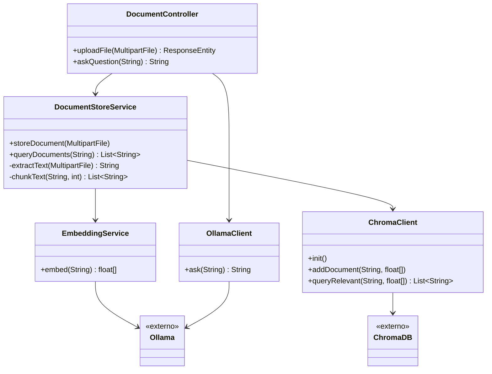

# Sistema de Consulta de Documentos com IA

## Objetivo
O objetivo é desenvolver e validar um sistema que permite o upload de documentos (PDF, TXT, DOC, DOCX) e a realização de consultas baseadas em linguagem natural sobre o conteúdo desses documentos. O sistema utiliza técnicas de Retrieval-Augmented Generation (RAG) para recuperar informações relevantes de documentos armazenados e gerar respostas precisas usando modelos de linguagem. O projeto foca na demonstração de viabilidade técnica, integração de tecnologias de IA e escalabilidade para aplicações reais, como consulta de documentação técnica.

Especificamente, o sistema deve:
- Processar documentos e armazenar seu conteúdo em um banco de vetores (ChromaDB).
- Gerar embeddings para os documentos e consultas usando modelos de embedding.
- Recuperar trechos relevantes com base em consultas do usuário.
- Gerar respostas concisas e precisas usando um modelo de linguagem local (Ollama).

## Tecnologias Utilizadas
- **Linguagem e Framework**:
    - Java 17
    - Spring Boot 3.x com Spring WebFlux (para chamadas assíncronas e reativas)
- **Gerenciamento de Dependências**:
    - Maven
- **Processamento de Documentos**:
    - Apache PDFBox (para PDFs)
    - Apache POI (para DOC e DOCX)
- **Banco de Vetores**:
    - ChromaDB (armazenamento e busca de embeddings)
- **Modelos de IA**:
    - Ollama (servidor local para modelos de linguagem e embedding)
    - Modelos:
        - Embedding: `snowflake-arctic-embed2` (1024 dimensões)
        - Geração de Texto: `gemma2` (escolhido por estabilidade e eficiência)
- **Outras Ferramentas**:
    - Docker e Docker Compose (para rodar o ChromaDB)
    - cURL (para testes de API)
    - SLF4J com Logback (para logging)

## Passo a Passo para Instalação
### Pré-requisitos
- Java 17 JDK
- Maven 3.8+
- Docker e Docker Compose
- macOS/Linux (testado em macOS; ajustes podem ser necessários para Windows)
- cURL (para testes)
- 8GB+ de RAM (para Ollama e ChromaDB)

### 1. Configurar o Ambiente
1. **Instalar Java e Maven**:
   ```bash
   brew install openjdk@17
   brew install maven
   ```
    - Configure `JAVA_HOME`: `export JAVA_HOME=$(/usr/libexec/java_home -v 17)`.

2. **Instalar Docker**:
   ```bash
   brew install docker docker-compose
   ```

3. **Instalar Ollama**:
   ```bash
   brew install ollama
   brew services start ollama
   ```

4. **Baixar Modelos do Ollama**:
   ```bash
   ollama pull gemma2
   ollama pull snowflake-arctic-embed2
   ```

### 2. Configurar o ChromaDB
1. Crie um arquivo `docker-compose.yml`:
   ```yaml
   version: '3'
   services:
     chromadb:
       image: chromadb/chroma
       ports:
         - "8001:8000"
       volumes:
         - chromadb_data:/chroma/chroma
   volumes:
     chromadb_data:
   ```
2. Inicie o ChromaDB:
   ```bash
   docker-compose up -d
   ```
3. Verifique:
   ```bash
   curl http://localhost:8001
   ```

### 3. Configurar o Projeto
1. Clone o repositório (ou crie um novo projeto Spring Boot com Maven).
2. Adicione as dependências ao `pom.xml`:
   ```xml
   <dependencies>
       <dependency>
           <groupId>org.springframework.boot</groupId>
           <artifactId>spring-boot-starter-webflux</artifactId>
       </dependency>
       <dependency>
           <groupId>org.apache.pdfbox</groupId>
           <artifactId>pdfbox</artifactId>
           <version>2.0.27</version>
       </dependency>
       <dependency>
           <groupId>org.apache.poi</groupId>
           <artifactId>poi</artifactId>
           <version>5.2.3</version>
       </dependency>
       <dependency>
           <groupId>org.apache.poi</groupId>
           <artifactId>poi-ooxml</artifactId>
           <version>5.2.3</version>
       </dependency>
       <dependency>
           <groupId>org.slf4j</groupId>
           <artifactId>slf4j-api</artifactId>
           <version>2.0.7</version>
       </dependency>
   </dependencies>
   ```
3. Configure `application.properties`:
   ```properties
   spring.application.name=ia-agent
   logging.level.com.github.mwacha.services=DEBUG
   ```

### 4. Estrutura do Código
Organize o projeto com os seguintes arquivos principais (conforme fornecido anteriormente):
- `Application.java`: Ponto de entrada do Spring Boot.
- `DocumentController.java`: Endpoints REST para upload (`/api/upload`) e consulta (`/api/ask`).
- `DocumentStoreService.java`: Processa documentos, gera chunks (1000 tokens) e armazena no ChromaDB.
- `ChromaClient.java`: Interage com a API REST do ChromaDB para adicionar e consultar documentos.
- `EmbeddingService.java`: Gera embeddings usando `snowflake-arctic-embed2`.
- `OllamaClient.java`: Gera respostas via `gemma2`, lidando com streaming de respostas.
- `QueryService.java`: Coordena a consulta, combinando embeddings, recuperação e geração de respostas.

### 5. Compilar e Executar
1. Compile o projeto:
   ```bash
   mvn clean install
   ```
2. Execute:
   ```bash
   mvn spring-boot:run
   ```

### 6. Testar a Aplicação
1. **Upload de Documento**:
   ```bash
   curl -X POST http://localhost:8080/api/upload \
     -F "file=@caminho/para/seu/documento.pdf"
   ```
    - Verifique o log: `Documento adicionado com sucesso à coleção my_collection`.

2. **Consulta**:
   ```bash
   curl --location 'http://localhost:8080/api/ask?q=No%20padr%C3%A3o%20arquitetural%20da%20test%20123%2C%20o%20que%20significa%20models%3F'
   ```
    - Resposta esperada:
      ```
      Models: Estruturas de dados que representam objetos de negócio. São utilizados para transferência de dados dentro do sistema.
      ```
## Estrutura do Projeto
```
ia-agent/
├── src/
│   ├── main/
│   │   ├── java/com/github/mwacha/
│   │   │   ├── controller/
│   │   │   │   └── DocumentController.java
│   │   │   ├── services/
│   │   │   │   ├── ChromaClient.java
│   │   │   │   ├── DocumentStoreService.java
│   │   │   │   ├── EmbeddingService.java
│   │   │   │   └── OllamaClient.java
│   │   │   └── IAAgentApplication.java
│   │   └── resources/
│   │       └── application.yml
│   └── test/
│       └── java/com/github/mwacha/
│           ├── controller/
│           │   └── DocumentControllerIntegrationTest.java
│           └── services/
│               ├── ChromaClientTest.java
│               ├── DocumentStoreServiceTest.java
│               ├── EmbeddingServiceTest.java
│               └── OllamaClientTest.java
├── pom.xml
└── README.md
```

## Fluxo de Classes e Arquitetura

### Fluxo de Classes
A aplicação segue uma arquitetura em camadas com responsabilidades claras para cada componente. Abaixo está o fluxo de interações entre as principais classes:

1. **DocumentController**:
    - Ponto de entrada para requisições da API REST.
    - Gerencia o endpoint `/api/upload` (POST) para receber `MultipartFile` e delega ao `DocumentStoreService`.
    - Gerencia o endpoint `/api/ask` (GET) para processar consultas, delegando ao `DocumentStoreService` para recuperação de documentos e ao `OllamaClient` para geração de respostas.

2. **DocumentStoreService**:
    - Gerencia o armazenamento e a recuperação de documentos.
    - Extrai texto de arquivos usando PDFBox (PDF) ou POI (DOCX).
    - Divide o texto em pedaços (`chunkText`) com um limite máximo de tokens.
    - Gera embeddings para os pedaços via `EmbeddingService` e armazena no ChromaDB via `ChromaClient`.
    - Recupera documentos relevantes para consultas usando `ChromaClient` e embeddings de consulta do `EmbeddingService`.

3. **EmbeddingService**:
    - Gera embeddings para pedaços de texto.
    - Chama a API do Ollama (modelo `snowflake-arctic-embed2`) usando `WebClient` para converter texto em arrays de `float`.

4. **ChromaClient**:
    - Interage com o banco de vetores ChromaDB.
    - Inicializa uma coleção (`init`).
    - Armazena documentos e embeddings (`addDocument`).
    - Consulta documentos relevantes (`queryRelevant`) com base em embeddings.

5. **OllamaClient**:
    - Interage com o modelo de linguagem Ollama (`gemma2`).
    - Gera respostas combinando consultas do usuário com documentos relevantes via `WebClient`.

### Fluxo de Operações
- **Upload de Documento**:
    1. `DocumentController` recebe um arquivo via `/api/upload`.
    2. `DocumentStoreService` extrai o texto e divide em pedaços.
    3. `EmbeddingService` gera embeddings para cada pedaço.
    4. `ChromaClient` armazena os pedaços e embeddings no ChromaDB.
- **Consulta**:
    1. `DocumentController` recebe uma consulta via `/api/ask`.
    2. `EmbeddingService` gera um embedding para a consulta.
    3. `DocumentStoreService` usa `ChromaClient` para recuperar documentos relevantes.
    4. `OllamaClient` gera uma resposta usando a consulta e os documentos recuperados.

### Diagrama Arquitetural
Abaixo está um diagrama em Mermaid ilustrando a arquitetura e as interações entre os componentes.


## Testes
### Testes Unitários
- **ChromaClientTest**: Testa a interação com o ChromaDB (WebClient mockado).
- **EmbeddingServiceTest**: Testa a geração de embeddings (WebClient mockado).
- **OllamaClientTest**: Testa a geração de respostas (WebClient mockado).
- **DocumentStoreServiceTest**: Testa a extração de texto, divisão em pedaços e armazenamento de documentos (dependências mockadas).

### Testes de Integração
- **DocumentControllerIntegrationTest**: Testa o fluxo completo (upload e consulta) usando Testcontainers para o ChromaDB e uma instância do Ollama em execução.

Execute os testes:
```bash
mvn test
```

## Dependências
- **Spring Boot 3.2.5**: WebFlux para API reativa.
- **Apache PDFBox 2.0.27**: Extração de texto de PDF.
- **Apache POI 5.2.3**: Extração de texto de DOCX.
- **Testcontainers 1.20.1**: ChromaDB nos testes de integração.
- **Mockito 5.12.0**: Mocking nos testes unitários.

## Configuração
Edite `src/main/resources/application.yml` para configurar:
- **URL do Ollama**: Padrão `http://localhost:11434`.
- **URL do ChromaDB**: Padrão `http://localhost:8000`.
- **Nome da Coleção**: Padrão `my_collection`.
## Problemas Encontrados
1. **Respostas Truncadas do Ollama**:
    - **Problema**: Modelos (`llama3`, `mistral`, `gemma2`) retornavam respostas parciais como `"According"`, `"Mod"`, ou `"E"`.
    - **Causa**: O `OllamaClient` não lidava com o streaming de respostas do endpoint `/api/generate`, capturando apenas o primeiro fragmento.
    - **Solução**: Modificado o `OllamaClient` para usar `WebClient.bodyToFlux()` e concatenar fragmentos até `"done": true`. Aumentado `max_tokens` para 1000.

2. **Recuperação de Chunks Irrelevantes**:
    - **Problema**: Inicialmente, o ChromaDB não retornava o chunk com a definição de "Models".
    - **Causa**: Tamanho pequeno dos chunks (500 tokens) e poucos resultados (`n_results=10`).
    - **Solução**: Aumentado o tamanho dos chunks para 1000 tokens e `n_results` para 20 no `DocumentStoreService` e `ChromaClient`.

3. **Validação Rígida no QueryService**:
    - **Problema**: Respostas parciais eram descartadas devido a validações como `response.equalsIgnoreCase("According")`.
    - **Solução**: Simplificada a validação para aceitar respostas não vazias e ajustado o prompt para ser mais direto.

4. **Instabilidade do Modelo**:
    - **Problema**: Modelos como `llama3` e `mistral` apresentavam respostas inconsistentes.
    - **Causa**: Possível sobrecarga ou comportamento instável dos modelos.
    - **Solução**: Migrado para `gemma2`, que provou ser mais estável e eficiente.

5. **Configuração do Ollama**:
    - **Problema**: Respostas truncadas persistiam mesmo com ajustes.
    - **Causa**: Versão potencialmente desatualizada ou configuração inadequada do Ollama.
    - **Solução**: Reinstalado o Ollama e garantida a versão mais recente (~0.6.5).

## Dúvidas que Podem Surgir
1. **Por que usar ChromaDB em vez de outros bancos de vetores?**
    - ChromaDB é leve, open-source e fácil de integrar via API REST, ideal para PoCs. Alternativas como Pinecone ou Weaviate podem ser consideradas para produção, mas requerem mais configuração.

2. **Por que escolher `gemma2` em vez de `llama3` ou `mistral`?**
    - `gemma2` mostrou maior estabilidade e eficiência em gerar respostas concisas, especialmente com prompts técnicos. `llama3` e `mistral` apresentaram truncamento e respostas inconsistentes.

3. **Como escalar o sistema para grandes volumes de documentos?**
    - Aumentar a capacidade do ChromaDB (mais nós ou armazenamento) e usar modelos de embedding mais robustos (ex.: `nomic-embed-text`). Para produção, considerar servidores dedicados para o Ollama e balanceamento de carga.

4. **O que fazer se o embedding não recuperar o chunk correto?**
    - Ajustar o tamanho dos chunks (`maxTokens`), aumentar `n_results`, ou testar outro modelo de embedding (ex.: `nomic-embed-text`). Também verificar a qualidade do documento (ex.: formatação, OCR para PDFs escaneados).

5. **Como lidar com documentos em outros idiomas?**
    - Usar modelos de embedding multilíngues (ex.: `multilingual-e5-large`) e configurar o ChromaDB para suportar embeddings de diferentes dimensões.

6. **Por que o streaming do Ollama causou problemas?**
    - O endpoint `/api/generate` retorna respostas em fragmentos, e o `OllamaClient` original não concatenava esses fragmentos. A solução com `Flux` resolve isso, mas desativar o streaming (`"stream": false`) é uma alternativa para simplicidade.

## Conclusão
A PoC foi bem-sucedida em demonstrar a viabilidade de um sistema RAG para consulta de documentos técnicos. O sistema permite o upload de documentos, armazenamento em um banco de vetores, e geração de respostas precisas com base em consultas em linguagem natural. A integração de Spring Boot, ChromaDB, e Ollama provou ser eficaz, embora tenha exigido ajustes para lidar com streaming de respostas e estabilidade dos modelos.

**Resultados**:
- Resposta correta para a consulta "No padrão arquitetural, o que significa models?" foi obtida: `Models: Estruturas de dados que representam objetos de negócio. São utilizados para transferência de dados dentro do sistema.`.
- O sistema é modular e pode ser estendido para suportar mais formatos de documentos, modelos de IA, e casos de uso.

**Lições Aprendidas**:
- O streaming de respostas requer tratamento cuidadoso em aplicações reativas.
- A escolha do modelo de linguagem impacta significativamente a qualidade das respostas.
- Logging detalhado (`DEBUG`) é essencial para diagnosticar problemas em sistemas de IA.

**Próximos Passos**:
- Otimizar o desempenho com modelos mais leves ou quantizados.
- Adicionar suporte a documentos multilíngues.
- Implementar autenticação e controle de acesso para uso em produção.
- Explorar integração com APIs de busca em tempo real para contextos dinâmicos.

Esta PoC estabelece uma base sólida para aplicações de consulta de documentos impulsionadas por IA, com potencial para escalabilidade e adaptação a cenários reais.